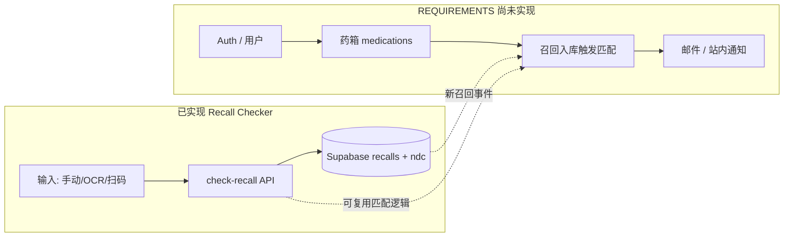

# 需求 vs 实现对比文档

**文档版本**：0.1  
**更新日期**：2026-05-19  
**对照基准**：[REQUIREMENTS.md](./REQUIREMENTS.md)（FDA Notification 全产品需求，v0.1）  
**实现范围**：[FDA Recall Checking System](../FDA%20Recall%20Checking%20System/)（同事交付，M1–M7 已完成）  
**实现规格**：[SPEC.md](../FDA%20Recall%20Checking%20System/SPEC.md)（查询子系统任务书）

---

## 目录

1. [执行摘要](#1-执行摘要)
2. [产品范围差异（必读）](#2-产品范围差异必读)
3. [需求逐项对照表](#3-需求逐项对照表)
4. [偏差与风险（重点）](#4-偏差与风险重点)
5. [Phase 1 MVP 完成度](#5-phase-1-mvp-完成度)
6. [建议的后续工作](#6-建议的后续工作)
7. [修订记录](#7-修订记录)

**状态图例**

| 符号 | 含义 |
|------|------|
| ✅ | 已实现且与需求一致（或接受范围内） |
| ⚠️ | 部分实现或与需求存在偏差 |
| ❌ | 未实现 |
| ➖ | 需求标为 P2/后续阶段，本期可不验收 |
| 🔶 | 实现超前于 REQUIREMENTS 排期（V1.1+ 能力已交付） |

---

## 1. 执行摘要

同事完成的 **FDA Recall Checking System** 是一条 **「按需召回查询」** 产品线：用户输入（手动 / OCR / 扫码）→ 确认 → 查本地 Supabase 召回库 → 展示 `recalled` / `possible` / `not_found` 及 Class I/II/III。

[REQUIREMENTS.md](./REQUIREMENTS.md) 定义的是 **「FDA Notification」全产品**：用户登记药箱 → 后台持续监控 → **主动**邮件/站内通知。

| 维度 | 结论 |
|------|------|
| 与 **查询子系统**（SPEC M1–M7） | 约 **85–90%** 完成，README 验收清单基本打勾 |
| 与 **REQUIREMENTS Phase 1 MVP（全产品）** | 约 **30–35%**（P0 项）；核心缺口：**账户、药箱、主动通知** |
| 数据与匹配底座 | 可复用：`recalls`、`ndc_products`、`check-recall` 逻辑、`/api/sync` |
| 评审前必对齐 | 两份文档 **产品边界不同**；不可用「M7 完成」等同于「Notification MVP 完成」 |

---

## 2. 产品范围差异（必读）

### 2.1 文档意图对比

| 项目 | REQUIREMENTS.md | SPEC.md + 已实现代码 |
|------|-----------------|----------------------|
| 核心用户旅程 | 注册 → 添加药品到药箱 → 等待召回 → **收到通知** | 打开 Web → 输入/扫码 → **立即查询** → 看结果 |
| 用户账户 | P0 必须（AUTH-01/02） | **明确不包含**登录/注册 |
| 扫码 / OCR | Phase 2（V1.1，P1） | **已包含**（M5/M6） |
| 主动通知 | Phase 1 P0（NOTIF） | **无** |
| 默认语言 | en-US（NFR-07） | UI 以**中文**为主 |

### 2.2 架构关系（建议理解）

---

## 3. 需求逐项对照表

### 3.1 业务目标（G）

| ID | 需求 | 优先级 | 状态 | 实现位置 / 说明 |
|----|------|--------|------|-----------------|
| G-01 | 登记用药 + 召回时主动通知 | P0 | ❌ | 无用户、无药箱、无通知通道 |
| G-02 | 查询/扫描判断是否召回 | P0 | ✅ | `RecallChecker`、`/api/check-recall`、`/api/extract` |
| G-03 | Class I/II/III 展示 | P0 | ✅ | `components/ResultPanel.tsx` |
| G-04 | Web MVP 快速上线 | P0 | ✅ | Next.js 15 + Vercel 部署说明 |
| G-05 | B2B 药房扩展 | P2 | ➖ | 未做，符合预期 |

### 3.2 账户与用户（AUTH）

| ID | 需求 | 优先级 | 状态 | 说明 |
|----|------|--------|------|------|
| AUTH-01 | 注册/登录 | P0 | ❌ | SPEC 排除；Supabase 仅 service role 服务端使用 |
| AUTH-02 | 密码重置 | P0 | ❌ | — |
| AUTH-03 | 可选用户资料 | P1 | ❌ | — |
| AUTH-04 | 人口统计字段 | P2 | ➖ | — |
| AUTH-05 | 删除账号 / 导出数据 | P1 | ❌ | — |
| AUTH-06 | MFA | P2 | ➖ | — |

### 3.3 药箱（MED）

| ID | 需求 | 优先级 | 状态 | 说明 |
|----|------|--------|------|------|
| MED-01 | 手动添加药物（搜索 NDC） | P0 | ❌ | 查询时可填 NDC，**不持久化**到用户药箱 |
| MED-02 | 记录 NDC（必填） | P0 | ❌ | 仅存在于单次 `query_logs`，非用户药品表 |
| MED-03 | 可选厂商/商品名 | P1 | ⚠️ | 确认表单支持，不落库 |
| MED-04 | 可选批号/效期 | P1 | ⚠️ | 确认表单 `lotNumber`；扫码可解析 lot（`lib/gtin.ts`） |
| MED-05 | 2–3 个月监控窗口 | P0 | ❌ | — |
| MED-06 | 编辑/删除/停用 | P0 | ❌ | — |
| MED-07 | 用药历史 | P1 | ❌ | 仅有匿名 `query_logs`（运维用） |
| MED-08 | 家庭成员 | P1 | ➖ | — |
| MED-09 | RxNorm 同成分扩展 | P1 | ➖ | 未实现 |

### 3.4 条码扫描（SCAN）

| ID | 需求 | 优先级 | 状态 | 说明 |
|----|------|--------|------|------|
| SCAN-01 | 扫码识别 NDC | P1 | 🔶 ✅ | `BarcodeTab` + `lib/gtin.ts`（UPC/EAN/GS1 DataMatrix） |
| SCAN-02 | 解析批号/效期 | P1 | 🔶 ✅ | GS1 AI (10)/(17) |
| SCAN-03 | 扫码即时查询（不入药箱） | P1 | 🔶 ✅ | 全流程即查询，无药箱概念 |
| SCAN-04 | 扫码失败引导 | P1 | 🔶 ⚠️ | 有部分 UI 提示；未单独做成需求级引导页 |
| SCAN-05 | 原生 App 相机 | P2 | ➖ | — |

### 3.5 FDA 数据（DATA）

| ID | 需求 | 优先级 | 状态 | 说明 |
|----|------|--------|------|------|
| DATA-01 | openFDA enforcement 拉取 | P0 | ✅ | `scripts/seed-recalls.ts`、`app/api/sync/route.ts` |
| DATA-02 | 增量同步 | P0 | ✅ | 默认 30 天 lookback，`recall_number` upsert |
| DATA-03 | 存储 Class I/II/III | P0 | ✅ | `recalls.classification` |
| DATA-04 | 召回元数据 | P0 | ⚠️ | 字段齐全；**缺**每条召回的 FDA Enforcement Report **官方深链** |
| DATA-05 | 解析 `code_info` | P1 | ⚠️ | 存原文 + 子串批号匹配；**未**结构化为 lot 列表 |
| DATA-06 | NDC 目录 | P0 | ⚠️ | `seed-ndc`、`ndc_products`；无 RxNorm |
| DATA-07 | 数据更新时间 | P0 | ✅ | `getLastSyncedAt`、`/api/meta`、结果页底部 |
| DATA-08 | 多数据源校验 | P2 | ➖ | — |
| DATA-09 | 化妆品/食品 | P2 | ➖ | — |

### 3.6 匹配引擎（MATCH）

| ID | 需求 | 优先级 | 状态 | 说明 |
|----|------|--------|------|------|
| MATCH-01 | NDC 精确匹配 | P0 | ✅ | `lib/check-recall.ts` → `ndcExactMatches` |
| MATCH-02 | 批号匹配 | P1 | ⚠️ | `lotInCodeInfo` 子串包含；无规范化规则文档 |
| MATCH-03 | 仅 NDC、无批号时的提示策略 | P0 | ⚠️ | **见 [§4.1](#41-match-03仅-ndc无批号)** |
| MATCH-04 | 新召回入库触发用户检查 | P0 | ❌ | 同步后无用户维度任务 |
| MATCH-05 | 用户加药触发历史召回扫描 | P0 | ❌ | 无加药流程 |
| MATCH-06 | 同用户同召回去重 | P0 | ❌ | 无通知故无去重 |
| MATCH-07 | 同成分/多厂家扩展 | P1 | ➖ | NDC 路径故意不 fuzzy，避免误报 |

### 3.7 通知（NOTIF）

| ID | 需求 | 优先级 | 状态 |
|----|------|--------|------|
| NOTIF-01 ~ NOTIF-07 | 邮件/站内/SMS/Push/偏好/重试 | P0–P2 | ❌ 全部未实现 |

### 3.8 召回 UI（UI）

| ID | 需求 | 优先级 | 状态 | 说明 |
|----|------|--------|------|------|
| UI-01 | 召回列表（筛选） | P1 | ❌ | 无独立浏览页 |
| UI-02 | 召回详情 + FDA 链接 | P0 | ⚠️ | 结果卡片展示字段；**无**详情路由与 `fda.gov` 深链 |
| UI-03 | 「我的药箱受影响」 | P0 | ❌ | — |
| UI-04 | 查询三态结果页 | P1 | 🔶 ✅ | `recalled` / `possible` / `not_found` |
| UI-05 | 免责声明 | P0 | ⚠️ | `Disclaimer.tsx` 有；**与结果页文案冲突**，见 [§4.2](#42-合规文案冲突leg-05) |

### 3.9 管理后台（ADMIN）

| ID | 需求 | 优先级 | 状态 | 说明 |
|----|------|--------|------|------|
| ADM-01 | 同步监控 | P0 | ⚠️ | `sync_runs` 表 + `/api/meta`；无 Admin UI、**无失败告警** |
| ADM-02 | 手动触发同步 | P1 | ✅ | `GET/POST /api/sync` + `CRON_SECRET` |
| ADM-03 | 匹配规则/黑名单 | P2 | ➖ | — |
| ADM-04 | 用户与通知审计 | P1 | ⚠️ | 仅有 `query_logs`（匿名查询），非用户级审计 |

### 3.10 药物相互作用（DDI）

| ID | 状态 |
|----|------|
| DDI-01 ~ DDI-03 | ❌ / ➖ 符合 V2 规划 |

### 3.11 非功能需求（NFR）

| ID | 需求 | 优先级 | 状态 | 说明 |
|----|------|--------|------|------|
| NFR-01 | 可用性 SLA | P1 | ➖ | 未定义 |
| NFR-02 | 性能指标 | P1 | ➖ | 未压测文档 |
| NFR-03 | 安全（账号加密等） | P0 | ⚠️ | HTTPS 依赖部署；**无用户账号体系** |
| NFR-04 | 隐私政策 | P0 | ❌ | 无独立页面 |
| NFR-05 | 删除/导出 | P0 | ❌ | — |
| NFR-06 | WCAG | P2 | ➖ | — |
| NFR-07 | en-US | P1 | ⚠️ | **UI 中文**，与需求默认语言不一致 |
| NFR-08 | 可观测性/告警 | P0 | ⚠️ | `sync_runs`、`query_logs`；无 Pager/邮件告警 |
| NFR-09 | openFDA 限流 | P0 | ✅ | `OPENFDA_API_KEY` |
| NFR-10 | 灾备 | P1 | ➖ | 依赖 Supabase 平台 |

### 3.12 合规（LEG）

| ID | 状态 | 说明 |
|----|------|------|
| LEG-01 SaMD 边界 | ⚠️ | 定位为查询工具，但未做法务归档 |
| LEG-02 HIPAA | ❌ | 无账户与 PHI 存储设计 |
| LEG-03 隐私政策/ToS | ❌ | — |
| LEG-04 人口统计 | ➖ | 未收集 |
| LEG-05 通知/结果文案 | ⚠️ | **结果页含「立即停止使用」**，见 [§4.2](#42-合规文案冲突leg-05) |

---

## 4. 偏差与风险（重点）

以下条目为 **「已实现但与 REQUIREMENTS 不一致」** 或 **「易引发误解/合规风险」** 的部分，评审与排期时应优先处理。

### 4.1 MATCH-03：仅 NDC、无批号

**需求（REQUIREMENTS）**：NDC 命中但无批号时，应提示用户 **「可能涉及，请核对瓶身批号」**（偏保守、避免过度确信）。

**实现（`lib/check-recall.ts`）**：

- 有 NDC、召回命中、**未提供批号** → 状态为 **`recalled`**（高置信召回）。
- 有 NDC、有批号、批号不在 `code_info` → **`possible`**（合理）。

**影响**：用户在只扫到 NDC（或不知道批号）时，会看到「已被召回」而非「可能涉及」，与需求保守策略 **不一致**；可能放大恐慌或法律文案风险。

**建议**：

- 无 `lotNumber` 时改为 `possible`，或 `recalled` + 醒目副文案要求核对批号；
- Class II/III 单独弱化主标题（见 4.2）。

---

### 4.2 合规文案冲突（LEG-05）

**需求**：不提供用药/停药建议；Class II/III 应引用 FDA 原文，避免「必须停药」。

**实现**：

| 位置 | 内容 | 问题 |
|------|------|------|
| `components/Disclaimer.tsx` | 「不构成医疗建议」、以 FDA/药师为准 | ✅ 与需求一致 |
| `components/ResultPanel.tsx`（`recalled`） | 「请**立即停止使用**并联系药师/医生」 | ❌ 与 Disclaimer、LEG-05 **直接冲突** |
| 同上 | 未按 Class II/III 区分是否建议继续用药 | ❌ 与 FDA 常见表述不符 |

**风险**：对外产品若沿用该文案，可能被认定为 **医疗建议**，与 Non-Goals 及 LEG-05 冲突。

**建议**：

- `recalled` 页改为：展示召回原因 + 链到 FDA 官方说明 +「请咨询药师/医生，勿自行停药」；
- Class II/III 使用琥珀色说明块，引用 enforcement 原文摘要。

---

### 4.3 UI-02：缺少 FDA 官方深链

**需求**：召回详情含 **FDA 原文/官方链接**（P0）。

**实现**：展示 `recall_number`、`code_info`、原因等，**无**跳转 `https://www.fda.gov/safety/recalls-market-withdrawals-safety-alerts` 或按 `recall_number` 构造的 Enforcement Report URL。

**影响**：用户无法一键核验官方信息，削弱「信息聚合」可信度。

---

### 4.4 NFR-07：界面语言

**需求**：MVP 仅 **en-US**。

**实现**：Class 标签、按钮、三态说明等为 **中文**（如「已被召回」「可能匹配」）。

**影响**：若目标用户为美国英语用户，与 REQUIREMENTS 及市场定位不一致（可作为独立产品决策，但需在 REQUIREMENTS 或 OQ 中显式修订）。

---

### 4.5 产品边界：SPEC 排除项 vs REQUIREMENTS P0

| 能力 | SPEC | REQUIREMENTS Phase 1 |
|------|------|----------------------|
| 用户账户 | **不包含** | **P0 必须** |
| 移动 App | **不包含** | Phase 3 |
| 主动通知 | 无 | **P0 必须** |

**风险**：若对外宣称「Notification MVP 已交付」，与事实不符。应在路线图标明：**Recall Checker = 子系统已完成**。

---

### 4.6 DATA-05：批号解析深度

**实现**：`code_info` 整段存储；匹配用 `code.includes(lot)`（大小写不敏感）。

**局限**：

- 无法处理「Lot A through C」等范围描述；
- 易因子串误命中（短 lot 串）；
- 未满足需求中「结构化 lot 列表」的 P1 目标。

**建议**：后续增加 `parsed_lots[]` 字段与规范化 pipeline，并维护黄金测试用例。

---

### 4.7 MATCH-04 / 05 / 06：监控闭环缺失

**需求**：召回入库 → 扫描所有/active 用户药箱 → 去重 → 通知。

**实现**：仅 Cron 同步 + 用户主动调用 `check-recall`。

**影响**：**G-01**、**M-01**（同步到通知延迟）、**M-04**（邮件送达）均无法验收。

---

### 4.8 实现超前（非偏差，但影响排期认知）

以下在 REQUIREMENTS 中属 **V1.1 / P1**，已实现：

- 扫码（SCAN-01~03）
- 拍照 OCR（客户端 Tesseract）
- 查询三态 UI（UI-04）

团队文档中 Phase 1 写「不含扫码」已与 **现状不符**，建议更新 [REQUIREMENTS.md §8](./REQUIREMENTS.md#8-发布阶段) 或在本对比文档中标注 **「已由 Recall Checker 提前交付」**。

---

## 5. Phase 1 MVP 完成度

依据 [REQUIREMENTS.md §8 Phase 1](./REQUIREMENTS.md#8-发布阶段) 所列 **必须项**：

| Phase 1 必须模块 | 完成情况 |
|------------------|----------|
| AUTH-01/02 | ❌ 0% |
| MED-01/02/05/06 | ❌ 0% |
| DATA-01~07 | ⚠️ ~85%（缺 FDA 深链、code_info 结构化） |
| MATCH-01/03~06 | ⚠️ ~25%（仅单次查询 MATCH-01；03 有偏差；04~06 无） |
| NOTIF-01/02/03 | ❌ 0% |
| UI-02/03/05 | ⚠️ ~40% |
| ADM-01 | ⚠️ ~50% |
| NFR-03/04/05/08/09 | ⚠️ ~40% |

**Phase 1 MVP（全产品）整体：约 30–35%**  

**可标记为「已完成」的子系统**：Recall Checker（查询 + 数据同步 + 识别），约 **85–90%**（相对 SPEC M1–M7）。

---

## 6. 建议的后续工作

### 6.1 文档

1. 在 [REQUIREMENTS.md](./REQUIREMENTS.md) 增加 **「子系统：Recall Checker（已完成）」** 章节，引用本文。
2. 将 Phase 1「不含扫码」改为「扫码由 Recall Checker 提供，Notification 复用 API」。

### 6.2 短期修复（可在现有仓库内完成）

| 优先级 | 项 | 关联 |
|--------|-----|------|
| P0 | 统一 `ResultPanel` 与 `Disclaimer` 文案 | §4.2 |
| P0 | 召回结果增加 FDA Enforcement 链接 | §4.3 |
| P1 | 无批号时 MATCH-03 策略调整 | §4.1 |
| P1 | UI 语言策略（en-US 或中英切换） | §4.4 |

### 6.3 Notification MVP 增量（新 Epic）

1. Supabase Auth + `user_medications` 表  
2. 召回 sync 后 job：`match_users_for_recall`（复用 `checkRecall`）  
3. 邮件 + 站内 `notifications` 表  
4. 页面：药箱、受影响列表、通知中心  

---

## 7. 修订记录

| 版本 | 日期 | 说明 |
|------|------|------|
| 0.1 | 2026-05-19 | 初版：对照 Recall Checking System M7 与 REQUIREMENTS v0.1 |

---

## 相关文档

- [REQUIREMENTS.md](./REQUIREMENTS.md) — 全产品需求基线  
- [FDA Recall Checking System README](../FDA%20Recall%20Checking%20System/README.md) — 实现验收与 API  
- [FDA Recall Checking System SPEC](../FDA%20Recall%20Checking%20System/SPEC.md) — 子系统范围（不含账户）
